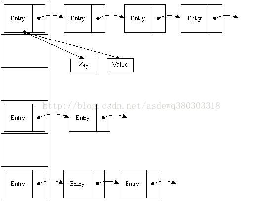

下文全部源码来自jdk1.7.0_71
## 1.hashMap的实现原理 ##
HashMap使用到的数据类型主要就是数组和链表，如图

## 2.hashMap是怎样实现key-value这样键值对的保存 ##
HashMap中有一个内部类Entry

    static class Entry<K,V> implements Map.Entry<K,V> {

        final K key;
        V value;
        Entry<K,V> next;
        int hash;
		……
    }
主要有4个属性，key ,hash,value,指向下一个节点的引用next ，看到这个实体类就明白了，在HashMap中存放的key-value实质是通过实体类Entry来保存的。

<!--more-->

## 3.HashMap的hash()函数 ##
Hash，一般翻译做“散列”，也有直接音译为“哈希”的，就是把任意长度的输入，通过散列算法，变换成固定长度的输出，该输出就是散列值。 这种转换是一种压缩映射，也就是，散列值的空间通常远小于输入的空间，不同的输入可能会散列成相同的输出，所以不可能从散列值来唯一的确定输入值。**简单的说就是一种将任意长度的消息压缩到某一固定长度的消息摘要的函数。**
所有散列函数都有如下一个基本特性：根据同一散列函数计算出的散列值如果不同，那么输入值肯定也不同。但是，根据同一散列函数计算出的散列值如果相同，输入值不一定相同。
两个不同的输入值，根据同一散列函数计算出的散列值相同的现象叫做**碰撞**。

    /**
     * Retrieve object hash code and applies a supplemental hash function to the
     * result hash, which defends against poor quality hash functions.  This is
     * critical because HashMap uses power-of-two length hash tables, that
     * otherwise encounter collisions for hashCodes that do not differ
     * in lower bits. Note: Null keys always map to hash 0, thus index 0.
     */
    final int hash(Object k) {
        int h = hashSeed;
        if (0 != h && k instanceof String) {
            return sun.misc.Hashing.stringHash32((String) k);
        }

        h ^= k.hashCode();

        // This function ensures that hashCodes that differ only by
        // constant multiples at each bit position have a bounded
        // number of collisions (approximately 8 at default load factor).
		//扰动：把高位的特征和低位的特征组合起来，降低哈希冲突的概率，也就是说，尽量做到任何一位的变化都能对最终得到的结果产生影响
        h ^= (h >>> 20) ^ (h >>> 12);
        return h ^ (h >>> 7) ^ (h >>> 4);
    }
上面是java7的HashMap hash()函数，下面是Java8的HashMap hash()函数:

	static final int hash(Object key) {
    	int h;
   	 	return (key == null) ? 0 : (h = key.hashCode()) ^ (h >>> 16);
	}
在JDK1.8的实现中，优化了高位运算的算法，通过hashCode()的高16位异或低16位实现的：(h = k.hashCode()) ^ (h >>> 16)，主要是从速度、功效、质量来考虑的。以上方法得到的int的hash值，然后再通过h & (table.length -1)来得到该对象在数据中保存的位置。
*（留个坑位，后续把string的hashcode方法补上）*
## 4.hashMap的put过程 ##
数组中存储的是最后插入的元素。

首先判断table，也就是数组是否为空，为空的话就去使用inflateTable的方法(这里不多解释)初始化hashmap。
如果table不为空的话，就判断key是否为空，为空的话就将放到数组的index=0的位置，如果value不为空则返回value值。
如果key不为空的话，就通过key获取hash值，通过hash值和table的长度与运算获取hashCode值。
通过hashCode的遍历entry<K,V>的键值对，如果key的hash值相等 并且key.equals(e.key)也相等的话,就将新的value替换掉旧的，返回旧值。
## 5.hashMap的get过程 ##
    public V get(Object key) {
        if (key == null)
            return getForNullKey();
        Entry<K,V> entry = getEntry(key);

        return null == entry ? null : entry.getValue();
    }
    private V getForNullKey() {
        if (size == 0) {
            return null;
        }
        for (Entry<K,V> e = table[0]; e != null; e = e.next) {
            if (e.key == null) //hashmap的key和value都可以为null
                return e.value;
        }
        return null;
    }
	//根据key获取entry
    final Entry<K,V> getEntry(Object key) {
        if (size == 0) {
            return null;
        }
		//1.先获取key的hash值，然后根据hash&table.length(实际用是（hash&table.length-1）)获取到数组元素
        int hash = (key == null) ? 0 : hash(key);
        for (Entry<K,V> e = table[indexFor(hash, table.length)];
             e != null;
             e = e.next) {
			//2.遍历该元素处的链表  
            Object k;
            if (e.hash == hash &&
                ((k = e.key) == key || (key != null && key.equals(k))))
                return e;
        }
        return null;
    }
## 6.HashMap扩容 ##
HashMap默认的负载因子大小为0.75，默认容量为1<<4，最大容量为1<<30。
每当填满75%的空间后将会创建原来HashMap大小的两倍的数组，来重新调整map的大小，并将原来的对象放入新的数组中，整个过程代价会越来越大，因此实际使用时应根据业务量尽量指定HashMap的初始大小

    void resize(int newCapacity) {
        Entry[] oldTable = table;
        int oldCapacity = oldTable.length;
        if (oldCapacity == MAXIMUM_CAPACITY) {
            threshold = Integer.MAX_VALUE;
            return;
        }

        Entry[] newTable = new Entry[newCapacity];
        transfer(newTable, initHashSeedAsNeeded(newCapacity));
        table = newTable;
		//计算下一次的扩容大小
		//The next size value at which to resize (capacity * load factor).
        threshold = (int)Math.min(newCapacity * loadFactor, MAXIMUM_CAPACITY + 1);
    }

    /**
     * Transfers all entries from current table to newTable.
     */
    void transfer(Entry[] newTable, boolean rehash) {
        int newCapacity = newTable.length;
        for (Entry<K,V> e : table) {
            while(null != e) {
                Entry<K,V> next = e.next;
                if (rehash) {
                    e.hash = null == e.key ? 0 : hash(e.key);
                }
                int i = indexFor(e.hash, newCapacity);
                e.next = newTable[i];
                newTable[i] = e;
                e = next;
            }
        }
    }
## 7.HashMap和Hashtable的区别 ##
- 1、HashMap是非线程安全的，HashTable是线程安全的。
- 2、HashMap的键和值都允许有null值存在，而HashTable则不行。
- 3、因为线程安全的问题，HashMap效率比HashTable的要高。
- 4、Hashtable是同步的，而HashMap不是。因此，HashMap更适合于单线程环境，而Hashtable适合于多线程环境。
-  一般现在不建议用HashTable, ①是HashTable是遗留类，内部实现很多没优化和冗余。②即使在多线程环境下，现在也有同步的ConcurrentHashMap替代，或由`Collections.synchronizedMap`方法获得一个线程安全的map,没有必要因为是多线程而用HashTable。

## 8.HashMap的遍历 ##
第一种:

	Map map = new HashMap();
	Iterator iter = map.entrySet().iterator();
	while (iter.hasNext()) {
		Map.Entry entry = (Map.Entry) iter.next();
		Object key = entry.getKey();
		Object val = entry.getValue();
	}
这种效率高,便利了一次entryset，key和value都放到了entry中，以后一定要使用此种方式！
第二种:

	Map map = new HashMap();
	Iterator iter = map.keySet().iterator();
	while (iter.hasNext()) {
		Object key = iter.next();
		Object val = map.get(key); //又拿了一次
	}

----------

